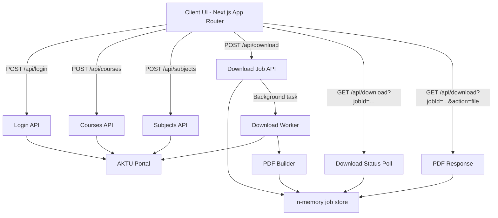

# AKTU Answer Script Downloader

A focused web app that logs into the AKTU portal, lists available exams and subjects, and generates a single PDF per subject by stitching the portal images together. Built with Next.js App Router and designed for clarity and speed.

## Why it exists
The AKTU portal is slow and awkward for downloading answer scripts. This app automates the navigation, fetches the images, and generates a PDF while showing real progress (pages downloaded).

## Features
- Login, course selection, and subject selection flow
- Dynamic parsing (no hardcoded semester names or evaluation labels)
- Progress feedback: pages downloaded / total pages
- One-click PDF generation per subject
- Clear error codes and request IDs for debugging

## Architecture



## How it works
1. **Login**: Server fetches the AKTU login page, collects hidden fields, submits credentials, and stores cookies.
2. **Courses**: Server loads the answer script page and extracts course options from the dropdown.
3. **Subjects**: Server selects the course and evaluation level (auto-detected), then parses the subjects table.
4. **Download**:
   - Server selects the subject.
   - Pages are requested and images are fetched with retries.
   - Images are stitched into a PDF (with a marks table page if available).
   - Client polls progress and downloads when ready.

## Local development
```bash
npm install
npm run dev
```

## Deployment (Vercel free tier)
- This app uses **no external paid services** by default.
- It should stay within the Vercel free tier as long as usage is modest.
- **Important**: Long downloads can exceed serverless execution limits. If you see frequent timeouts, deploy to a small VPS or a host that allows longer-running Node processes.

## Notes
- The password field is intentionally visible (no masking), as requested.
- If AKTU changes their HTML structure significantly, parsing may fail. Error codes and request IDs help pinpoint failures quickly.
